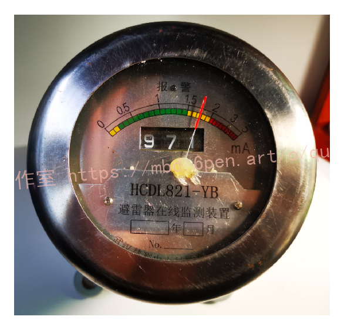
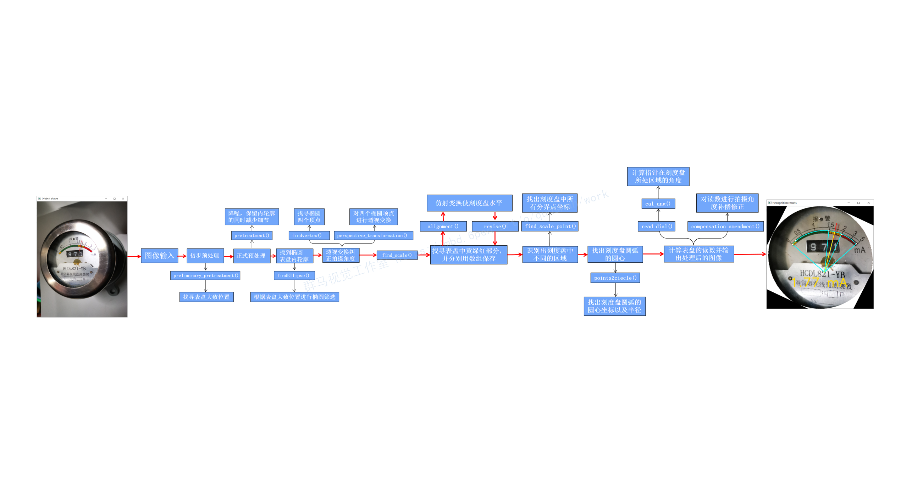
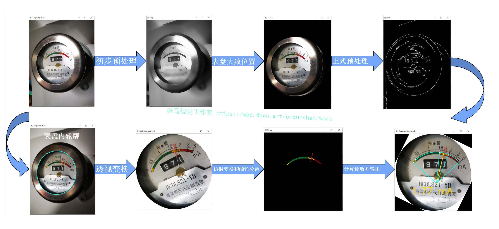
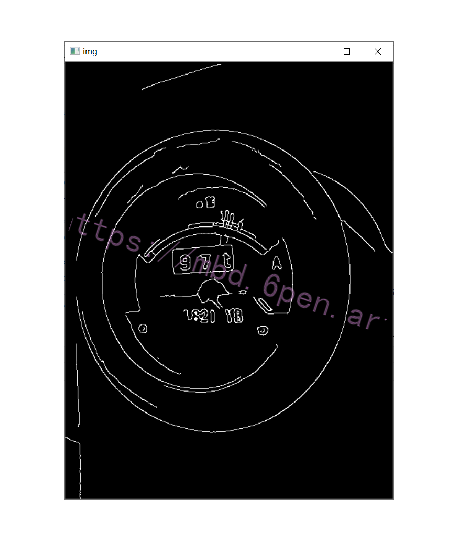
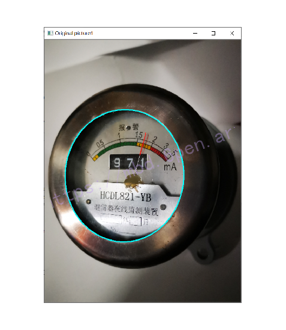
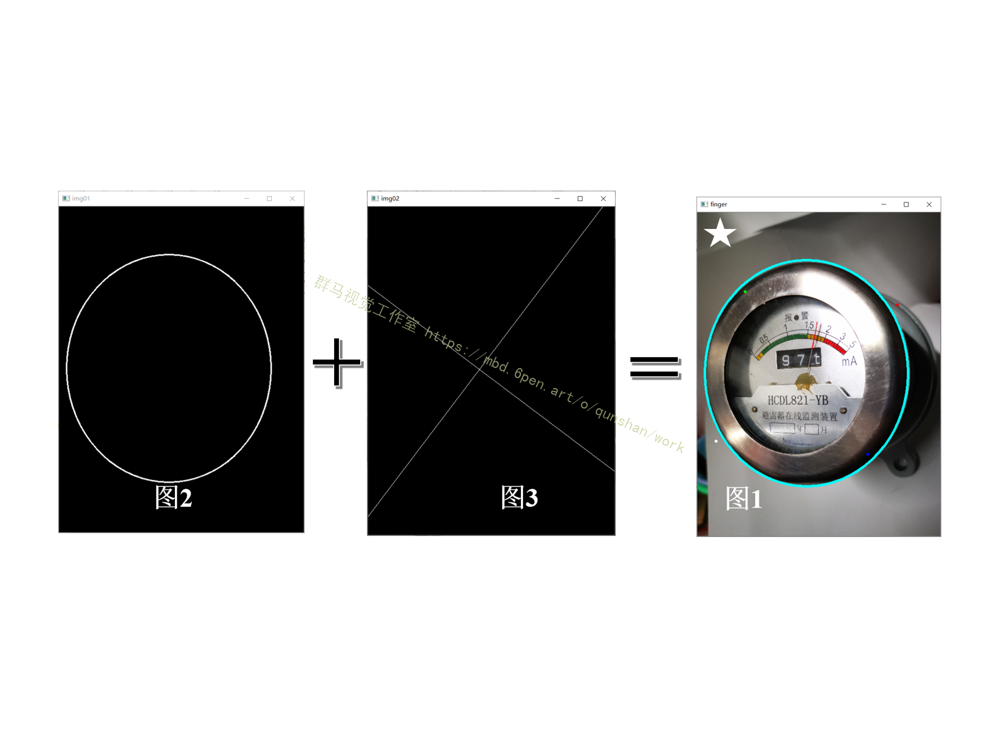
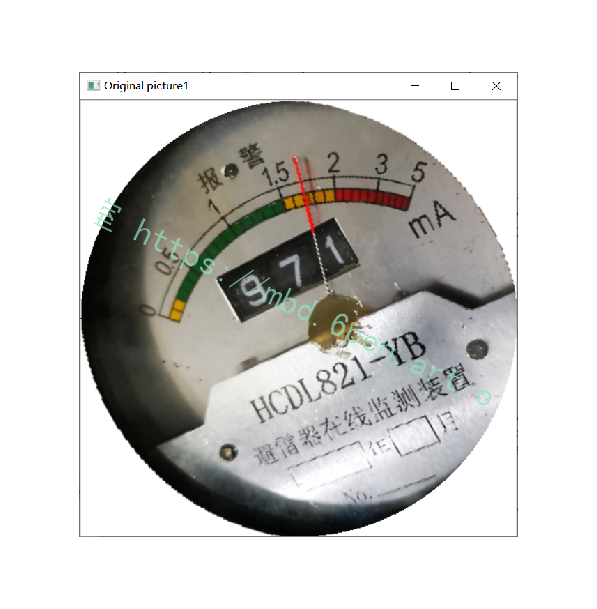
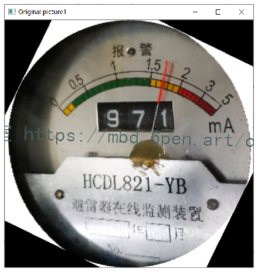


# 1.背景
指针式机械表盘具有安装维护方便、结构简单、防电磁干扰等诸多优点， 目前广泛应用于工矿企业、能源及计量等部门。随着仪表数量的增加及精密仪表技术的发展，人工判读已经不能满足实际应用需求。随着计算机技术和图像处理技术的不断发展，指针式机械表自动读表技术应运而生。该技术提高了表盘识别的自动化程度及实时性，将代替传统工业仪表的读取方式得到广泛应用。
# 2.国内外研究现状
**识别对象的型号**：HCDL821-YB 避雷在线监测装置



**识别难点**：
1.内表盘很深，导致内表盘面阴影严重，给内椭圆的识别增加难度。
2.电表外轮廓反光严重，如果采用点光源照明，会产生亮斑和眩光现象。
3.电表内表盘反光严重，导致不同角度颜色不同，不利于阈值的设置。
4.电表外轮廓经过打磨圆角处理，导致识别的椭圆外轮廓精度下降。

**表盘特点**：刻度盘和指针具有颜色，而且不同的颜色区间代表不同的刻度值范围。
# 3.算法的特点
1.可以识别不同光照条件下的表盘：强光、正常光、弱光、点光源、平行光源等。
2.可以识别不同拍摄角度的表盘：正面、左斜侧、右斜侧、前斜侧、后斜侧等。
3.可以识别不同距离的表盘：近距离拍摄、中距离拍摄、远距离拍摄等。
4.可以识别带干扰颜色的场景：红色桌子、白色墙纸、绿色桶、蓝色盆子等。
5.可以识别不同尺寸、像素的表盘照片。
6.识别效率高：整个程序运行时间在10秒以内，而传统的椭圆检测程序就需要一分钟以上。
# 4.[算法流程图](https://afdian.net/item?plan_id=0ce112e45d8d11ed88e452540025c377)


# 5.算法过程可视化


# 6.初步处理
**preliminary_pretreatment()**
该函数进行表盘大致位置的找寻，该函数的亮点是一个参数自调整的cv.HoughCircles()。
其中param2参数会根据找寻圆的结果进行自动调整。（param2是检测阶段圆心的累加阈值，它越小，可以检测到更多的假圆。它越大，能通过检测的圆越少且更加接近完美的圆。）

```python
circles, param, x, y, r = [ ], 50, 0, 0, 0
     while 1:
             circles = cv.HoughCircles(pre, cv.HOUGH_GRADIENT, 1, 20, param1=100, param2=param, minRadius=100, maxRadius=300)
               if  circles  is  None:
                         param = param - 5
                         continue
               circles = np.uint16(np.around(circles))
               for i in circles[0 ,  : ]:
                         if  i[2]  >  r and i[2]  <  width / 2:
                                  r = i[2]
                                  x = i[0]
                                  y = i[1]
               break
      
```
# 7.预处理
**pretreatment()**
[参考该博客提出的pretreatment()函数](https://mbd.pub/o/bread/Yp6UmZ5y)，是图像预处理步骤，对图像进行灰度化、高斯滤波降噪、卷积模糊、边缘检测、形态学闭变换。


```python
gray = cv.cvtColor(img, cv.COLOR_BGR2GRAY)
img_thresh = cv.GaussianBlur(gray, (5, 5), 0)
kernel = np.ones((5, 5), np.float32) / 25
img_thresh = cv.filter2D(img_thresh, -1, kernel)
edges = cv.Canny(img_thresh, 50, 150, apertureSize=3)
Matrix = np.ones((2, 2), np.uint8)
img_edge = cv.morphologyEx(edges, cv.MORPH_CLOSE, Matrix)
```


**findEllipse()**
该函数主要通过cv.fitEllipse()函数来拟合椭圆，再对拟合出的多条椭圆进行多条件的筛选，其中一个重要的筛选条件就是根据初步预处理center()函数得到的大致范围。

```python
    contours, hierarchy = cv.findContours(img, cv.RETR_EXTERNAL, cv.CHAIN_APPROX_NONE)
    X, Y, ma, MA,angle = 0, 0, 0, 0, 0
    height, width, channels = img_copy.shape

    for   ind, cont  in  enumerate(contours):
         if (len(cont) > 5):
              (X0, Y0), (MA0, ma0), angle0 = cv.fitEllipse(cont)
              if  ma0 < min(width,height)  and  MA0 < max(width,height)  and  distance(X0, Y0, x, y) < 1 / 2 * r  and  ma0 > ma  and  MA0 > MA（等）:
                   X, Y, MA, ma, angle = X0, Y0, MA0, ma0, angle0
```


# 8.透视变换纠正拍摄角度
**findvertex()**

```python
points = []
img1 = np.zeros((img_copy.shape[0], img_copy.shape[1]), dtype=np.uint8)
cv.ellipse(img1, (int(X), int(Y)), (int(MA / 2), int(ma / 2)), angle, 0, 360, (255, 255, 255), 2)
img2 = np.zeros((img_copy.shape[0], img_copy.shape[1]), dtype=np.uint8)
cv.line(img2, (int(X - math.cos(angle) * ma), int(Y + math.sin(angle) * ma)),
        (int(X + math.cos(angle) * ma), int(Y - math.sin(angle) * ma)), (255, 255, 255), 1)
cv.line(img2, (int(X + math.sin(angle) * MA), int(Y + math.cos(angle) * MA)),
        (int(X - math.sin(angle) * MA), int(Y - math.cos(angle) * MA)), (255, 255, 255), 1)
for i in range(img_copy.shape[0]):
    for j in range(img_copy.shape[1]):
        if img1[i, j] > 0 and img2[i, j] > 0:
            points.append((j, i))
point = list([])
n = points[0][0]
for i in range(len(points)):
    if abs(points[i][0] - n) > 2:
        point.append(points[i])
        n = points[i][0]
point.append(points[0])
img3 = np.zeros((img_copy.shape[0], img_copy.shape[1]), dtype=np.uint8)
cv.ellipse(img3, (int(X), int(Y)), (int(MA / 2), int(ma / 2)), angle, 0, 360, (255, 255, 255), -1)
for i in range(img_copy.shape[0]):
    for j in range(img_copy.shape[1]):
        if img3[i, j] == 0:
            img_copy[i,j] = 255
order = []
order.append(point[np.argmin(point, axis=0)[1]])
order.append(point[np.argmax(point, axis=0)[1]])
order.append(point[np.argmin(point, axis=0)[0]])
order.append(point[np.argmax(point, axis=0)[0]])
return img_copy,order
```


**perspective_transformation()**
透视变换指两个平面之间中心投影变换，该函数通过透视变换来矫正拍摄角度，减小刻度盘的圆度误差。

```python
w = min(img_copy.shape[0], img_copy.shape[1])
pts1 = np.float32([[point[0][0], point[0][1]], [point[1][0], point[1][1]],
                             [point[2][0], point[2][1]],[point[3][0], point[3][1]]])
pts2 = np.float32([[w / 2, 0], [w / 2, w], [0, w / 2], [w, w / 2]])
M = cv.getPerspectiveTransform(pts1, pts2)
dst = cv.warpPerspective(img_copy, M, (w, w))
```


# 9.仿射变换使刻度盘水平
**alignment()**
仿射变换是一种二维坐标到二维坐标之间的线性变换，它保持了二维图形的“平直性”（直线经过变换之后依然是直线）和“平行性”（二维图形之间的相对位置关系保持不变，平行线依然是平行线，且直线上点的位置顺序不变）。

```python
x0, y0,xlen,ylen = farpoint(point_k,point_k[-1]),x0 - point_k[-1][0],y0 - point_k[-1][1]
deg = math.degrees(rad)
image_center = tuple(np.array(img_copy.shape)[:2] / 2)
rot_mat = cv.getRotationMatrix2D(image_center, deg, 1)
dst_copy = cv.warpAffine(img_copy, rot_mat, img_copy.shape[:2], flags=cv.INTER_LINEAR)
output = cv.warpAffine(output, rot_mat, output.shape[:2], flags=cv.INTER_LINEAR)
```


# 10.读取表盘刻度
farpoint()和nearpoint()#找出刻度盘中所有分界点。
points2ciecle()#来根据刻度盘上任意三个点找出刻度盘圆弧的圆心坐标以及半径
cal_ang()#对三个点构成的角度进行输出
根据刻度盘的每一个分界点对刻度盘进行分区（分为0、1、2、3四个部分），最后根据前面得到的两个角度以及指针所处的分区得出最终指针在刻度盘的读数，从而完成整个电表表盘的识别。


# 11.参考文献
参考博客[《Python基于OpenCV的指针式表盘检测系统》](https://mbd.pub/o/qunma/work)
参考博客[《基于OpenCV的指针式表盘检测系统》](https://s.xiaocichang.com/s/5090fe)

---
#### 如果您需要更详细的【源码和环境部署教程】，除了通过【系统整合】小节的链接获取之外，还可以通过邮箱以下途径获取:
#### 1.请先在GitHub上为该项目点赞（Star），编辑一封邮件，附上点赞的截图、项目的中文描述概述（About）以及您的用途需求，发送到我们的邮箱
#### sharecode@yeah.net
#### 2.我们收到邮件后会定期根据邮件的接收顺序将【完整源码和环境部署教程】发送到您的邮箱。
#### 【免责声明】本文来源于用户投稿，如果侵犯任何第三方的合法权益，可通过邮箱联系删除。